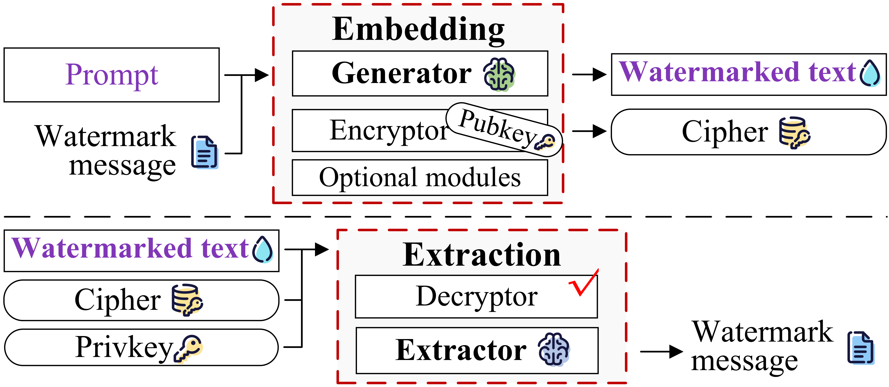
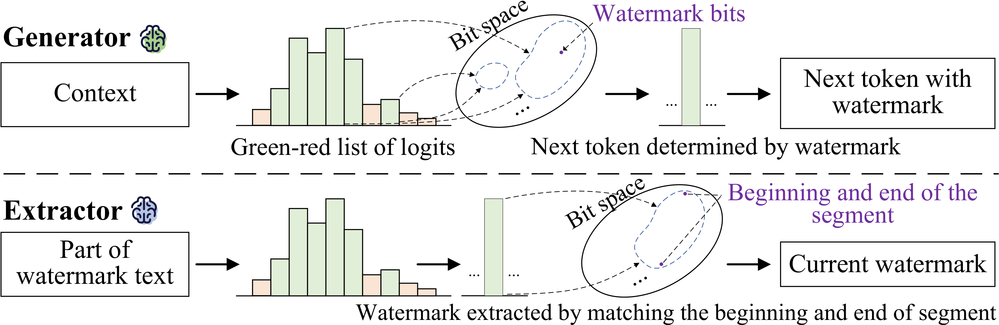
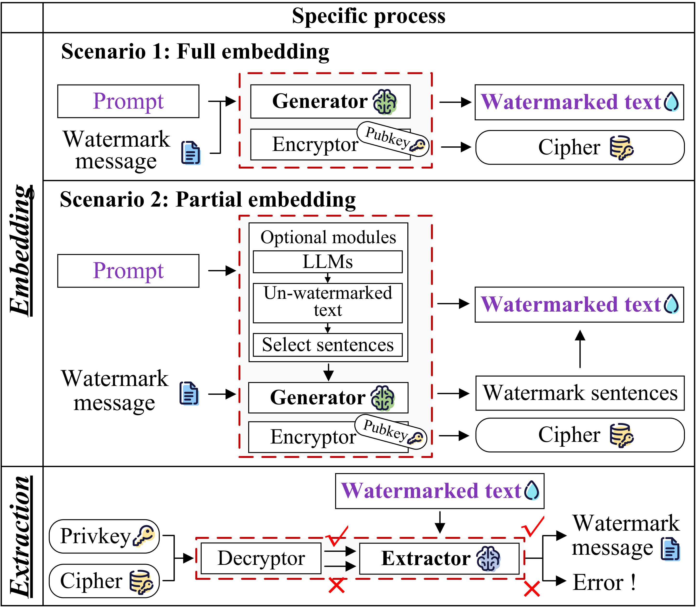

# An Entirely Extracted and Secure Multi-bit Watermark for Large Language Models.
***Overall process:***

***Generator and Extractor:***

## 1. Datasets
Commonly used datasets in the field of natural language processing and watermarking are used to evaluate the performance of ESMark, which are the instruction following task: [AlpacaFarm](https://github.com/tatsu-lab/alpaca_farm), the question answering tasks: [ELI5](https://github.com/facebookresearch/ELI5) and [FinQA](https://sites.google.com/view/fiqa/home). You can get these datasets from [here](https://github.com/THU-KEG/WaterBench/tree/main/data/WaterBench).

## 2. Models
The models we used are **LLama2-7B-chat** / **ChatGLM3-6B**. You can get the LLama2-7B-chat from [here](https://huggingface.co/meta-llama/Llama-2-7b-chat-hf) and ChatGLM3-6B from [here](https://huggingface.co/THUDM/chatglm3-6b).

## 3. Conda Environment
Python 3.10

`pip install -r requirements.txt`

## 4. Metrics
In the folder `./Metrics`, we present the codes for evaluating the performance of watermarked text, where the **BERT** and **LLaMA3-8B** models used can be obtained from [BERT](https://huggingface.co/docs/transformers/model_doc/bert) and [LLaMA3-8B](https://huggingface.co/meta-llama/Meta-Llama-3-8B).

## 5. Watermark information
To simulate various watermark information, we randomly generated a pseudo-random bit string of 500,000 bits, and embedded them at a random initial starting position when embedding information. The details of the bit string are shown in the folder `./watermark_information`.

## 6. Watermarked texts of ESMark
In the folder `./watermark_text`, we present the watermarked texts generated using the ESMark scheme. In addition, there are examples of tampered text and watermark extraction when verification fails, please refer to `./watermark_text/Ours_attack` and `./watermark_text/V_fail`. When this work is published, all watermarked texts will be made public.

## 7. Attack & Trace
In the folder `./Attack_trace`, we present the code for the substitution attack and tracing tampered locations, using the **RoBERTa** model which can be obtained from [here](https://huggingface.co/docs/transformers/model_doc/roberta).

## 8. Unforgeability
In the folder `./Unforgeability`, we present the code for the unforgeability in the private detection, using the **RoBERTa** model which can be obtained from [here](https://huggingface.co/docs/transformers/model_doc/roberta).

## 9. Multiple Scenarios
We designed full embedding and partial embedding scenarios, and the codes are run: `ESMark_full.py` and `ESMark_partial.py`.

